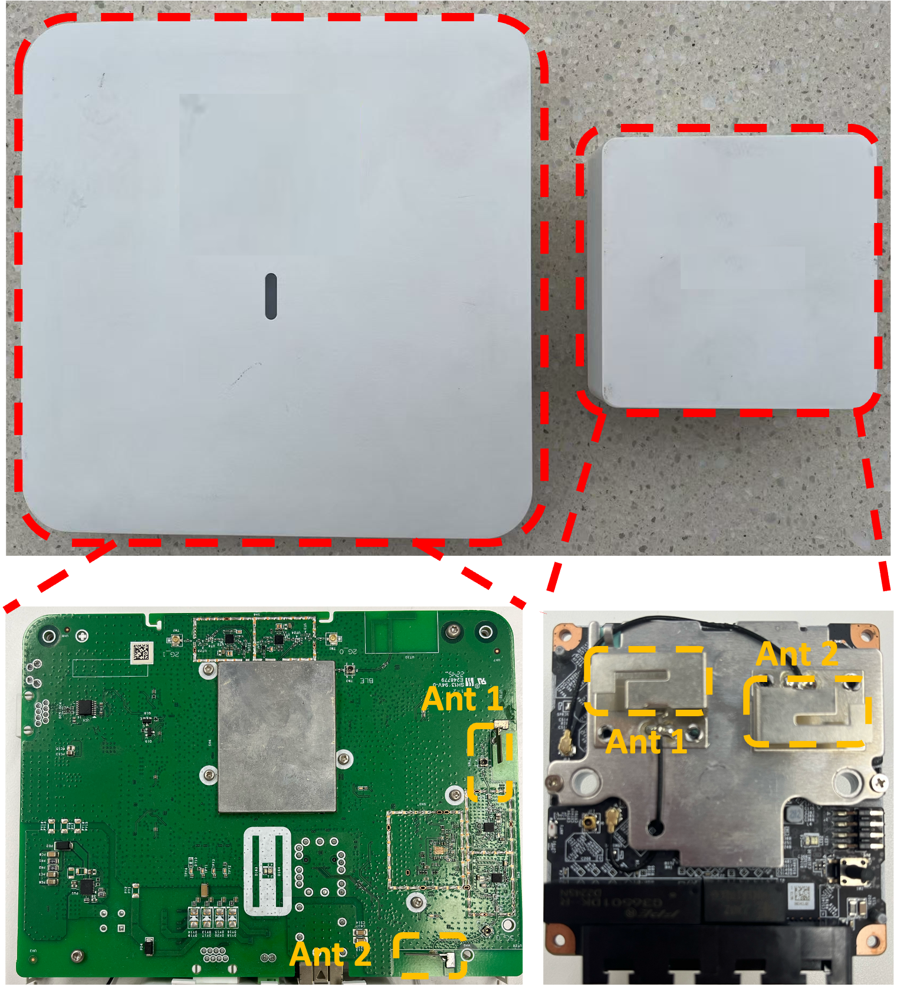

# MILD(Multi-smartphone Indoor Localization Dataset)

MILD(Multi-smartphone Indoor Localization Dataset) is an open-source Wi-Fi indoor localization dataset collected from multiple users and smartphones. It contains both RSSI, CSI data and corresponding 2-D location labels for localization purposes. In the following, we provide a more detailed introduction to this dataset.

## Why This Dataset？

Most existing works focus on collecting data using tools like the Intel 5300 NIC. Although these studies have explored various localization techniques, their methods have yet to be validated on real, communication-capable devices. Specifically, the differences mainly lie in the following three aspects:

- **Deployed AP vs. Specialized Receiver**: Deployed access points typically have fewer antennas with wider spacing, which makes it difficult to leverage angle-of-arrival (AoA) features for localization.
- **Communication Packets vs. Probing Packets**: During actual communication between smartphones and access points, various special data patterns are present, which can affect the characteristics of the CSI measured by the AP.
- **Off-the-shelf Terminal vs. Specialized Transmitter**: The diversity in hardware implementations across different smartphone manufacturers further influences the CSI data measured by the AP.

To advance CSI-based localization toward real-world applications, it is necessary to conduct targeted research addressing the above issues. To facilitate such efforts, we provide this dataset for further investigation.

## Dataset Introduction

* 22 smartphones（21 device type）
* 15 volunteers

## Dataset Implementation

### Hardware Configuration

#### 1. Smartphones

Our localization dataset is entirely based on real commercial off-the-shelf smartphones. Detailed information is provided in the table below.

| Smartphone Manufacturers |                        Terminal Type                         |
| :----------------------: | :----------------------------------------------------------: |
|          iPhone          |      iPhone 11, 12, 13, 13 Mini, 14, 14 Pro, 15 Pro Max      |
|          XIAOMI          | 8 SE, 13 (×2), 14, Redmi K20 Pro,  Redmi K30S Ultra, Redmi K40, Redmi Note 12-Turbo |
|          Others          | Honor X10, Honor 60, Honor Magic 4 Pro Oneplus Ace2, Huawei Mate10, Meizu 16s, Pixel 4 |

#### 2. Access Points（APs）

This localization dataset is based on commercial access points (APs) deployed in a building, as illustrated in the figure below. Two models of APs are used: 6520 (left in the figure) and 6522H-HI (right in the figure).

|    AP    | **Number of Antennas** | Antenna Spacing | **Operating Frequency Band** |
| :------: | :--------------------: | :-------------: | :--------------------------: |
|   6520   |           2            |     7.47 cm     |             5GHz             |
| 6522H-HI |           2            |     3.3 cm      |             5GHz             |

> [1] [H3C WA6520 New Generation Access Point-H3C](https://www.h3c.com/en/Products_and_Solutions/InterConnect/Wireless/Products/AP/Wi-Fi_6/Indoor/WA6520/)
>
> [2] [H3C WA6522H-HI Wi-Fi 6(802.11ax)-H3C](https://www.h3c.com/cn/Products_And_Solution/InterConnect/Products/IP_Wlan/Products/Panel_AP/WiFi_6/WA6522H_HI/)

#### 3. Ultra Wide Band（UWB）

Ultra-Wideband (UWB) is a wireless technology capable of high-precision ranging, and it has been widely adopted for localization tasks, achieving accuracies down to the millimeter or centimeter level [1]. Such high-precision UWB systems are more than sufficient to supervise Wi-Fi-based localization at the decimeter level, a practice that has been validated in multiple studies [2–4].

In our data collection scenario, a total of four anchors and one tag are used. The four anchors are placed at the four corners of the collection area to ensure optimal UWB localization performance. During data collection, the tag is attached to the user’s head to record the ground-truth trajectory, while the four anchors are used to measure the distances from the tag to themselves. After data collection, the UWB system’s coordinate output is obtained using trilateration and is used as the ground truth.

> [1] Ma J, Zhang F, Jin B, et al. Push the limit of highly accurate ranging on commercial uwb devices[J]. Proceedings of the ACM on Interactive, Mobile, Wearable and Ubiquitous Technologies, 2024, 8(2): 1-27.
>
> [2] Liu K, Yang W, Chen M, et al. Deep-learning-based wireless human motion tracking for mobile ship environments[J]. IEEE Internet of Things Journal, 2022, 9(23): 24186-24198.
>
> [3] Zhang T, Zhang D, Wang G, et al. RLoc: Towards robust indoor localization by quantifying uncertainty[J]. Proceedings of the ACM on Interactive, Mobile, Wearable and Ubiquitous Technologies, 2024, 7(4): 1-28.
>
> [4] Wang G, Zhang D, Zhang T, et al. Learning domain-invariant model for WiFi-based indoor localization[J]. IEEE Transactions on Mobile Computing, 2024.

### Data Capture

#### Time Synchronization

Before data collection, we synchronized the APs and the computer controlling the UWB system using the Network Time Protocol (NTP). To ensure precise time alignment, we enforced synchronization between devices before each data recording session.

#### Collection

Prior to data collection, volunteers were instructed to wear a helmet equipped with a UWB tag to ensure that the UWB-reported location accurately corresponds to the user’s physical location.

The specific data collection area is indicated by the red rectangle in the figure below. During the collection process, volunteers were allowed to move freely within this area while holding their smartphones up.

## Data Details

|  Data Type  |      Data Format      |                     Discisption                     |
| :---------: | :-------------------: | :-------------------------------------------------: |
| timestamps  | packet_num x 1 double |  Timestamp used to record the data collection time  |
|    rssi     | packet_num x 2 double | RSSI values indicating signal strength and distance |
|  csi_data   |  1 x packet_num cell  |      CSI values reflecting spatial information      |
|   channel   | packet_num x 1 double |       Channel on which the data was collected       |
| center_freq | packet_num x 1 double |         Center frequency of the subcarriers         |
|  ap_names   | packet_num x 1 double |       Name of the AP that collected the data        |
|   coords    | packet_num x 2 double | Coordinates provided by UWB (used as ground truth)  |

## How to access the MILD dataset

To obtain the dataset, please sign the [agreement](https://github.com/Intelligent-Perception-Lab/MILD/blob/main/files/MILD DATASET RELEASE AGREEMENT.pdf) by yourself. And **additionally**:

- If you are a researcher from China, please ensure that the agreement is stamped with the official seal of your institution.
- If you are not from China, please ask your director or team leader to sign the agreement.

Once stamped/signed, you can scan and send it to [wangguanz@mail.ustc.eu.cn](mailto:wangguanz@mail.ustc.edu.cn). Then you will receive a notification email that includes the download links of the dataset within seven days. Thank you for your cooperation.

## Citation

Coming soon...

## Releated Dataset

> [1] [DLoc](https://github.com/ucsdwcsng/DLoc_pt_code)
>
> [2] [H-WILD](https://github.com/H-WILD/human_held_device_wifi_indoor_localization_dataset)
>
> [3] [Camera-WiFi_localization_dataset](https://anonymous.4open.science/r/Camera-WiFi_localization_dataset-8E5F/README.md)

